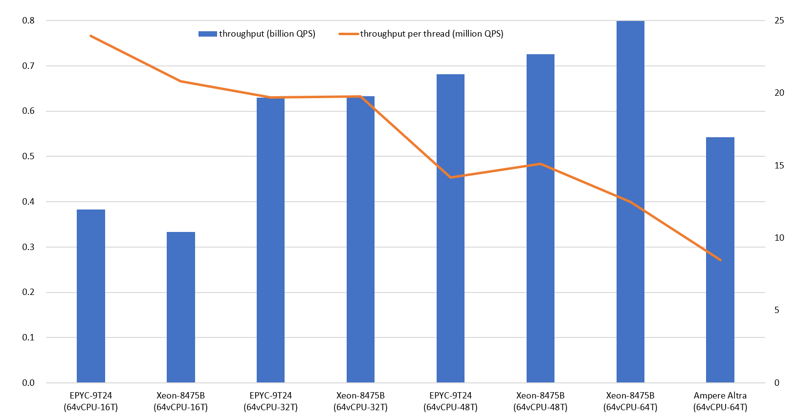

# fastCHD
[CHD算法](http://cmph.sourceforge.net/chd.html)的一种实现，针对现代硬件平台优化，可提供单机亿级QPS。

### 关键特性
* 极小的空间开销（每项4.3比特）
* 惊人的读取性能
* 快速生成，失误率极低
* 在线不可写
* 要求CPU支持小端非对齐内存访问（X86、ARM、RISC-V等）

### 其他解决方案
* [极速版](https://github.com/PeterRK/SSHT)
* [可写版](https://github.com/PeterRK/estuary)

---
[【中文】](README-CN.md) [【英文】](README.md)
