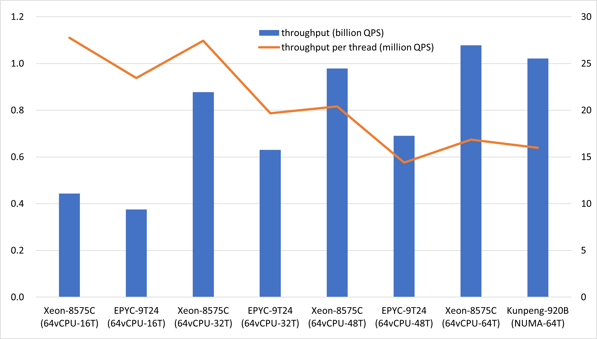

# Skew Hash and Displace

## 算法描述

本算法在[CHD](http://cmph.sourceforge.net/chd.html)算法的基础上做了改进，使用倾斜Hash作为一级Hash函数，令头部桶中元素天然比尾部桶多。

在一级Hash环节，倾斜Hash比CHD使用的均匀更合理，因此SHD算法可以以更高的密度达到和CHD算法接近的性能。

十亿数据的构建耗时在数十秒水平，稍逊于fastCHD（见本项目的chd分支）。

和fastCHD（见本项目的chd分支）一样，可提供单机亿级读取QPS。

## 关键特性
* 极小的空间开销（每项3.9比特）
* 惊人的读取性能
* 快速生成，失误率极低
* 在线不可写
* 要求CPU支持小端非对齐内存访问（X86、ARM、RISC-V等）

## 其他解决方案
* [极速版](https://github.com/PeterRK/SSHT)
* [可写版](https://github.com/PeterRK/estuary)

---
[【中文】](README-CN.md) [【英文】](README.md)
