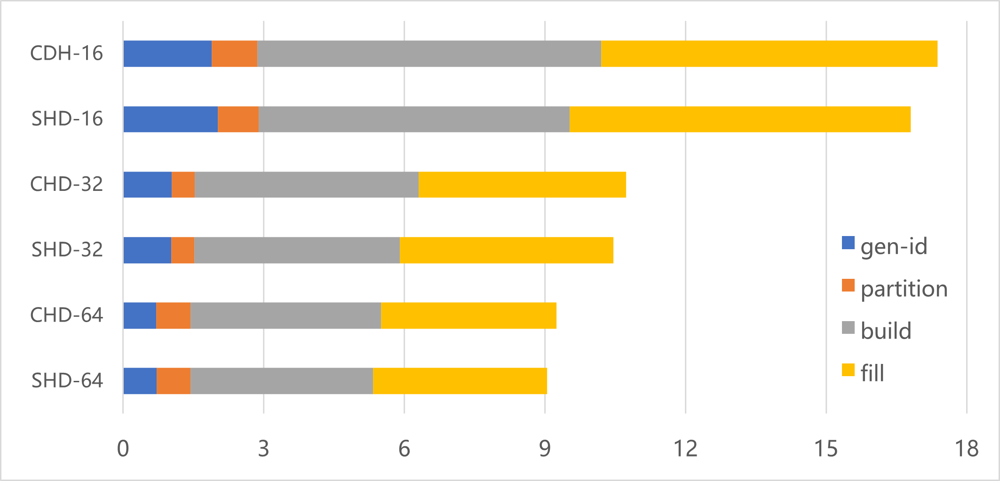

# Skew Hash and Displace

## Algorithm Discription

This algorithm introduces an improvement on [CHD](http://cmph.sourceforge.net/chd.html), using skew hash as first level hash function to make elenments in head buckets more than those in tail buckets。

Because it's more resonable to use skew hash instead of uniform hash in first level hashing, SHD can achieve higher density than CHD with almost the same performance.

Building dictionary with one billion data costs tens of secoends, a little slower than fastCHD (can be found in chd branch).

It can provide sub-billion level QPS on single machine, just like fastCHD (can be found in chd branch).

## Key Features
* extreme low space overhead (3.9 bits per item)
* amazing read performance
* fast build with extreme low false failure rate
* no online writing
* work on CPU support little-endian unaligned memory access (X86，ARM，RISC-V...)

## Other Solutions
* [faster reading](https://github.com/PeterRK/SSHT)
* [online writable](https://github.com/PeterRK/estuary)

---
[【Chinese】](README-CN.md) [【English】](README.md)
